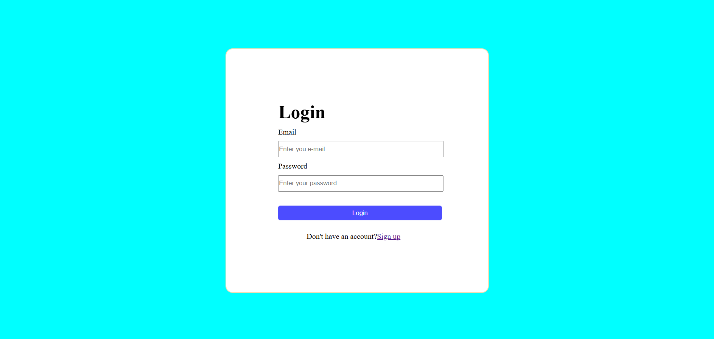

# Responsive Login & Signup Page 🔐

This project is a simple **responsive Login and Signup page** built using **HTML and CSS**.  
It is designed so that I will understand the form layouts, styling, and basic page structure.

---

## ✨ Features

- Clean and simple UI
- Login page with email & password
- Signup page with user registration form
- Responsive layout using Flexbox & Grid
- Beginner-friendly project structure

---

## 🛠️ Technologies Used

- HTML5
- CSS3 (Flexbox & Grid)

---

## 📂 Project Structure

LogIn-page/
│
├── index.html # Login page
├── signup.html # Signup page
├── style.css # Login page styles
├── signup.css # Signup page styles
└── README.md


---

## 🚀 How to Run the Project

1. Clone the repository:
   ```bash
   git clone https://github.com/Vamsi-Madabathula/LogIn-page.git
Open the folder:

cd LogIn-page
Open index.html in your browser.

📸 Screenshots
Login Page



Signup Page
(Add screenshot here if you want)

🎯 Learning Outcomes
Creating forms using HTML

Styling forms using CSS

Using Flexbox for centering

Using CSS Grid for layout

Building a basic multi-page project

📌 Future Improvements
Form validation using JavaScript

Show/Hide password feature

Backend integration

Improved responsiveness

👨‍💻 Author
Vamsi Madabathula

GitHub: Vamsi-Madabathula

⭐ If you like this project, feel free to star the repository!


---

## ✅ How to add this README to GitHub

1️⃣ Create a file:
```bash
README.md
2️⃣ Paste the content
3️⃣ Save
4️⃣ Push:

git add README.md
git commit -m "Added README file"
git push


#In Future 
1. User Entered data is stored on database.
2. Check's the Enter password and Existing password.
3. After login to the site is opening.
